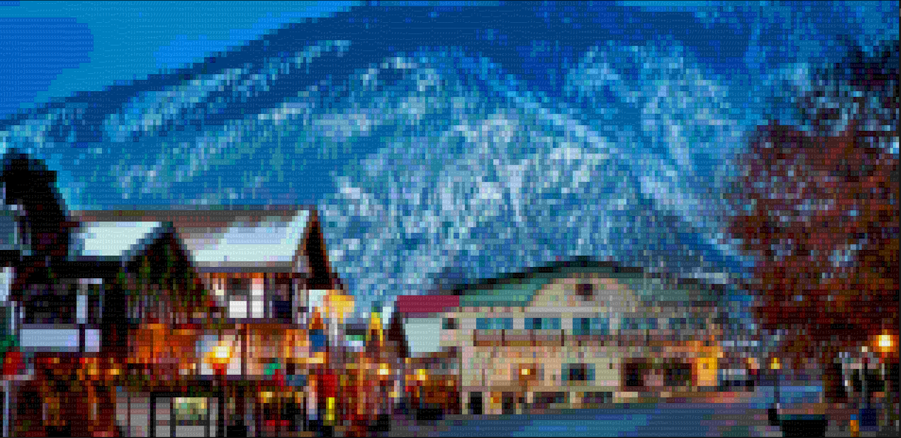
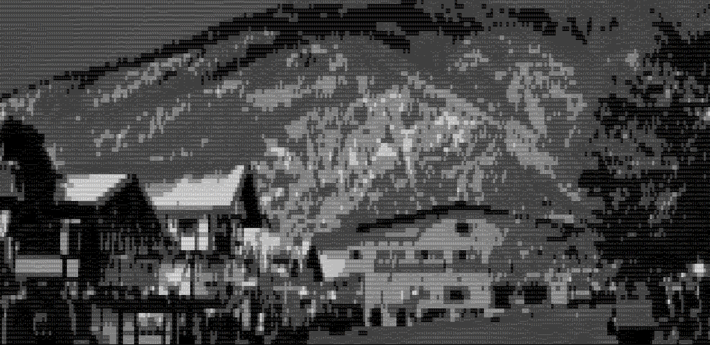
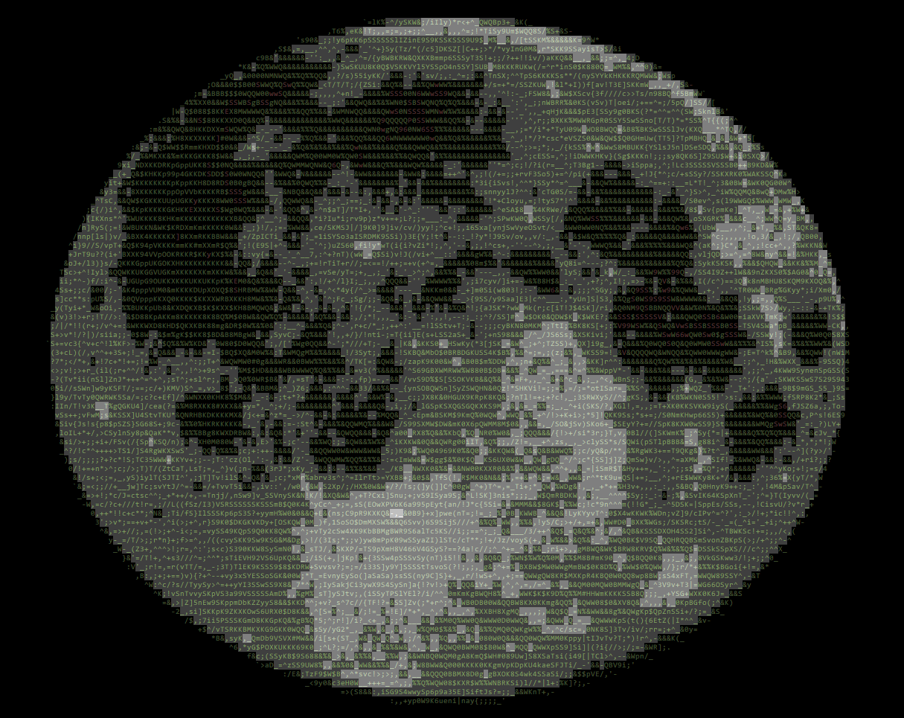
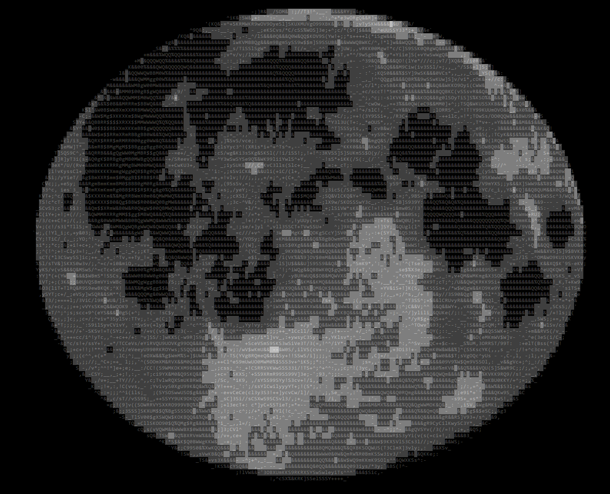

# Photo Art.

This project renders images to a terminal using ASCII escape sequences.

Using OpenCV and the [PrettyConsole](https://github.com/BenCarter44/PrettyConsole/tree/PhotoArt) library, a picture is split up into many different cells and then rendered onto the screen.

The number of intermediate colors can also be adjusted, as this program
changes both the characters used, text color, and the background text highlighting.

Modify `STYLE_PARTS` in the respective python file to adjust the number of background tones available for painting the picture. The smaller the number, the greater the emphasis on the text characters used (more ASCII like). The larger the number, the more "real RGB" it is, while being less text-based.

## Algorithms (for mapping colors) used:
- HSL algorithm. Samples using HSL color scheme.
- RGB algorithm. Samples using RGB color scheme.
- Black and White. Samples in monochrome. 

HSL/RGB both generate different results. The better one depends on the image.

## The Moon:

^ A HSL algorithm. (Notice the text coloring)

^ Black and White. (Notice greater emphasis on the characters used to get a shading effect)